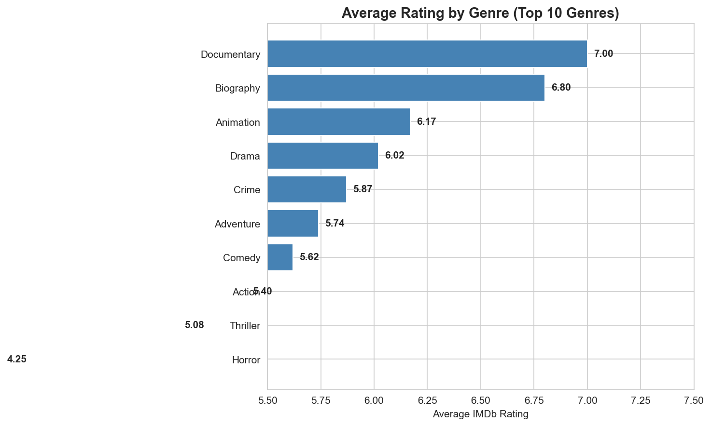
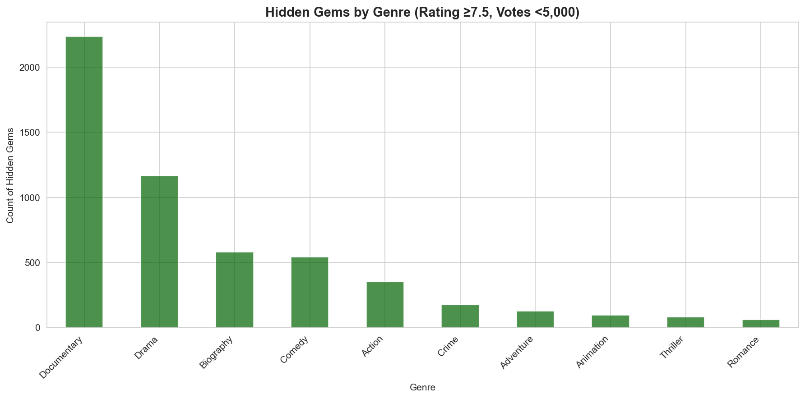

# Film Analysis Project

> **Data-Driven Insights for Theatrical Film Booking Strategy**
>
> A portfolio project analyzing 85,000+ movies to uncover patterns in audience preferences and genre performance.


---

## 🎬 Project Overview

This project analyzes IMDb movie data (2000–2024) to identify strategic opportunities for theatrical film booking. Using statistical analysis and data visualization, I uncovered key insights about genre performance, the relationship between popularity and quality, and hidden gems in the film landscape.

**Key Finding:** The correlation between popularity (vote count) and quality (rating) is only **0.135** — revealing significant opportunities for quality-focused curation.

---

## 📊 Key Insights

### Genre Performance Rankings
| Rank | Genre | Avg Rating | Insight |
|------|-------|------------|---------|
| 🥇 | Documentary | **7.00** | Highest satisfaction, loyal niche |
| 🥈 | Biography | **6.80** | Strong word-of-mouth potential |
| 🥉 | Animation | **6.17** | Family-friendly, reliable |
| 9 | Horror | **4.25** | Lowest ratings, programming risk |

### Hidden Gems Discovered: **5,623 films**
- High quality (Rating ≥7.5) but low awareness (Votes <5,000)
- 40% are documentaries — underserved market
- Prime candidates for specialized programming

### Blockbuster Analysis
- **1,970 true blockbusters** (100K+ votes)
- Action dominates (38%) but doesn't guarantee quality
- Only 8% of blockbusters rate "Excellent" (8.0+)

---

## 🗂️ Repository Structure

```
Film Analysis Project/
├── README.md                           # This file
├── Strategic_Recommendations_Report.md # Full strategic report
├── Tableau_Dashboard_Design.md         # Dashboard specifications
├── data_raw/                           # Source datasets
│   ├── imdb_movies_cleaned.csv         # 85,891 movies
│   ├── imdb_movies_sample.csv
│   └── imdb_reviews_cleaned.csv        # 50K sentiments
├── notebooks/
│   └── 01_exploratory_analysis.ipynb   # Jupyter notebook
├── outputs/                            # Generated artifacts
│   ├── *.png                           # 6 visualization charts
│   ├── imdb_for_tableau.csv           # Tableau-ready data
│   └── key_insights.txt
└── scripts/
    ├── clean_imdb.py                   # Sentiment cleaning
    └── clean_imdb_metadata.py          # IMDb data cleaning
```

---

## 🚀 Getting Started

### Prerequisites
```bash
pip install pandas matplotlib seaborn jupyter
```

### Running the Analysis
```bash
# Clone the repository
git clone https://github.com/tnbradley/film-analysis-project.git
cd film-analysis-project

# Launch Jupyter notebook
jupyter notebook notebooks/01_exploratory_analysis.ipynb
```

### Viewing the Data
The cleaned dataset (`data_raw/imdb_movies_cleaned.csv`) contains:
- 85,891 movies from 2000–2024
- 15 fields including title, genre, rating, votes, runtime
- Pre-calculated categories (ratingCategory, popularityTier)

---

## 📈 Visualizations

### 1. Genre Performance


### 2. Hidden Gems by Genre


*See `outputs/` directory for all 6 charts including:*
- Popularity vs. Rating scatter plot
- Decade trends analysis
- Blockbuster genre breakdown
- Overall rating distribution

---

## 🎯 Strategic Recommendations

### For Film Bookers
1. **Prioritize documentaries** for Tuesday/limited programming — highest satisfaction scores
2. **Create "Hidden Gems" series** — 5,623 identified films with booking potential
3. **Use rating data in screen allocation** — high-rated blockbusters deserve premium screens

### For Marketing
1. **Target film enthusiasts** with discovery campaigns
2. **Eventize quality cinema** — documentaries as special experiences
3. **Differentiate from streaming** through curation

*See `Strategic_Recommendations_Report.md` for full details*

---

## 🛠️ Tech Stack

- **Python** — Data cleaning, analysis, visualization
- **Pandas** — Data manipulation and aggregation
- **Matplotlib/Seaborn** — Statistical visualizations
- **Jupyter** — Interactive exploration
- **Tableau** — Executive dashboard (design spec included)
- **GitHub** — Version control and portfolio hosting

---

## 📊 Data Sources

- **IMDb Non-Commercial Datasets** — 85,891 movies (2000-2024)
  - `title.basics` — Movie metadata
  - `title.ratings` — User ratings and vote counts
  - `title.crew` — Director/writer information
- **IMDb 50K Reviews** — Sentiment analysis dataset

*Data used under IMDb Non-Commercial Licensing terms*

---

## 🔮 Future Enhancements

- [ ] Build Tableau dashboard (design spec complete)
- [ ] Add box office revenue data for ROI analysis
- [ ] Implement predictive ML model for film performance
- [ ] Expand to streaming platform data for competitive analysis

---

## 👤 Author

**Troy Bradley**
- Data Analytics Graduate (Correlation One — Honors)
- Location: Knoxville, TN
- Email: troy@bradleys.email

---

## 📄 License

- **Code:** MIT License
- **Data:** IMDb Non-Commercial Datasets (subject to IMDb terms)

---

## 🙏 Acknowledgments

- IMDb for providing the non-commercial datasets
- Correlation One for data analytics training
- Regal Cinemas for the Film Analyst role inspiration
